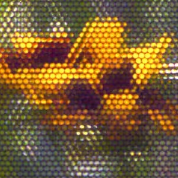

# Lytro Lumigraph



The Lytro Lumigraph is an experimental structured lumigraph used for rendering images from the original [Lytro light field camera](https://en.wikipedia.org/wiki/Lytro). This project was developed as part of my entry for the Bluesky 2026 Shitty Camera Challenge. I'm fascinated by light field capture and rendering techniques, and so I couldn't turn down an opportunity to dust off my Lytro and put it through its paces.

##  Fundamentals

The Lytro camera essentially works like a compound eye. It has a sheet of microlenses that sits over its image sensor, and so photos that the camera takes are split up into over 100k 10x10 lens images. This means in practice that rather than sampling all of the light that moves through a focal point like in a regular camera, we are instead sampling a "focal plane" of light from the local light field.

Once we have a capture of the light field, we can extract a regular image by sampling from each microlens. By being selective about which parts of each lens we sample from when rendering our final image, we can do things like shift our view in the scene, or refocus the photo by scaling up and down each lens. Being able to refocus and shift vantage point also allows us to see the physical properties of objects in a scene in a way that a regular camera can't capture - for instance reflectivity and translucency are much more obvious.

## Extracting Lytro images

Lytro shut down in 2018, and their software for downloading images and processing LFP files remains proprietary. Additionally the Lytro Desktop app no longer runs on modern Macs. I looked into using the [Lytro Unlock](https://github.com/ea/lytro_unlock) project to download files over wifi, but was ultimately unsuccesful. Thankfully I have an old Windows laptop with the software installed that I can use to pull down the files.

I'm using lfpsplitter from [lfptools](https://github.com/nrpatel/lfptools) to pull out the unbayered raws and metadata from the lfp files, and then converting the raws to grayscale tiffs with raw2tiff. In `scripts/demosaic.py` you can see my OpenCV script for finally converting the tiff into a color image. My gamma and color correction values seem to be constant in my camera metadata, if you want to reuse this project for processing your own photos you'll need to update those values. `scripts/workflow.sh` is just a time saving shell script to run an image through these steps.

## The lumigraph

The lumigraph is a simple webpage built with [Vite](https://vite.dev/) and [Three.js](https://threejs.org/). It uses Three's newer WebGPU renderer, so it may not work in all browsers. To start it up locally:

```
npm i
npm run dev
```

For each microlens in the image, we render a circle, and texture the circle with the image that the microlens captured. The texture can be shifted in the X and Y, scaled up and down, and the "aperture" (basically a cutoff function from the center) can be adjusted. The microlenses are rendered in two passes, first in RGB and again in a solid color pass of 0x010101. Each lens is rendered additively, so the RGB values can exceed 255 in both passes. We divide the RGB pass by the red channel of the solid color pass, and get a normalized image with averaged colors in the microlens overlaps.

Like the image processing variables I mentioned earlier, there are some hardcoded values in `src/dots.ts` that need to be adjusted for finding your own camera's exact grid points for microlenses.

## Ongoing work

* Some sort of animation of the XY offsets
* Video exports
* Addressing issues with color casts and hot pixels
* More fun interactivity
